# Polyglot Codebase Knowledge Graph

> Generated offline by **readmenator**. Supports C, C++, Python, Go, Rust, JS/TS, Java, C#, Shell, PHP, Dart, GDScript, Nim, ASM.
> No LLMs. No tokens. Pure static analysis. See more [here](https://github.com/grisuno/ReadMenator)

**Total Files Parsed:** 4 | **Total Symbols Extracted:** 3 | **Total Imports:** 9

## Structural Knowledge Map

```mermaid
graph TD
    classDef mod fill:#1e1e1e,stroke:#ff6666,stroke-width:2px,color:#fff;
    classDef cls fill:#2d2d2d,stroke:#4ec9b0,stroke-width:2px,color:#fff;
    classDef fn fill:#333,stroke:#dcdcaa,stroke-width:1px,color:#dcdcaa;
    classDef ext fill:#111,stroke:#666,stroke-dasharray:5 5,color:#aaa;
    viewerpe_py["viewerpe.py (py)"]
    class viewerpe_py mod;
    viewerpe_py_add_dict_to_tree["add_dict_to_tree"]
    class viewerpe_py_add_dict_to_tree fn;
    viewerpe_py --> viewerpe_py_add_dict_to_tree
    viewerpe_py_add_list_to_tree["add_list_to_tree"]
    class viewerpe_py_add_list_to_tree fn;
    viewerpe_py --> viewerpe_py_add_list_to_tree
    viewerpe_py_visualize_pe_json["visualize_pe_json"]
    class viewerpe_py_visualize_pe_json fn;
    viewerpe_py --> viewerpe_py_visualize_pe_json
    pe_gui_viewer_py["pe_gui_viewer.py (py)"]
    class pe_gui_viewer_py mod;
    app_py["app.py (py)"]
    class app_py mod;
    install_sh["install.sh (sh)"]
    class install_sh mod;
    ext_streamlit["streamlit"]
    class ext_streamlit ext;
    pe_gui_viewer_py -.->|imports| ext_streamlit
    ext_json["json"]
    class ext_json ext;
    pe_gui_viewer_py -.->|imports| ext_json
    ext_os["os"]
    class ext_os ext;
    pe_gui_viewer_py -.->|imports| ext_os
    viewerpe_py -.->|imports| ext_json
    ext_sys["sys"]
    class ext_sys ext;
    viewerpe_py -.->|imports| ext_sys
    ext_rich["rich"]
    class ext_rich ext;
    viewerpe_py -.->|imports| ext_rich
    ext_rich_tree["rich.tree"]
    class ext_rich_tree ext;
    viewerpe_py -.->|imports| ext_rich_tree
    ext_rich_panel["rich.panel"]
    class ext_rich_panel ext;
    viewerpe_py -.->|imports| ext_rich_panel
    ext_rich_text["rich.text"]
    class ext_rich_text ext;
    viewerpe_py -.->|imports| ext_rich_text
```

---

## Architecture Reference

### PY (3 files)

#### `app.py`
**Path:** `app.py`

*No symbols extracted*

#### `pe_gui_viewer.py`
**Path:** `pe_gui_viewer.py`

*No symbols extracted*

#### `viewerpe.py`
**Path:** `viewerpe.py`

**Functions:**
- `add_dict_to_tree` (line 9) `def add_dict_to_tree(parent_node, d, prefix)` - *Agrega recursivamente un dict al árbol de rich.*
- `add_list_to_tree` (line 21) `def add_list_to_tree(parent_node, lst)` - *Agrega una lista al árbol: si son dicts, los expande; si no, los muestra como items.*
- `visualize_pe_json` (line 36) `def visualize_pe_json(data)`

### SH (1 files)

#### `install.sh`
**Path:** `install.sh`

*No symbols extracted*
