# Polyglot Codebase Knowledge Graph

> Generated offline by **readmenator**. 4 files, 3 symbols, 9 imports. Supports C, C++, Python, Go, Rust, JS/TS, Java, C#, Shell, PHP, Dart, GDScript, Nim, ASM, Ruby, Swift, Kotlin, Scala, Lua, Elixir.
> No LLMs. No tokens. Pure static analysis. See more [here](https://github.com/grisuno/ReadMenator)

**Start here:** Statistics Dashboard for scope, God Nodes for blast radius, Architecture Reference for per-file API. Agents: prefer `readmenator-agent/INDEX.md` + `SYMBOLS.md`.

**Wiki:** prefer `readmenator-wiki/index.md` for progressive disclosure: one synthesis page per community, `connections.json` with EXTRACTED vs INFERRED confidence, `queries.md` log, `REPORT.md` audit.

**Confidence:** EXTRACTED = parsed from source, INFERRED = heuristic bridge, AMBIGUOUS = reported, never hidden. See `readmenator-wiki/REPORT.md`.

**Total Files Parsed:** 4 | **Total Symbols Extracted:** 3 | **Total Imports:** 9

<!-- ranking_model: v1.0 | weights: {ppr:0.45,auth:0.2,test:0.15,doc:0.1,fresh:0.1} | alpha:0.85 | commit:1e0fd0b | date:2026-07-18 -->


## Table of Contents

1. [Statistics Dashboard](#statistics-dashboard)
2. [Architectural Layers](#architectural-layers)
3. [Ranked Context](#ranked-context)
4. [God Nodes](#god-nodes)
5. [Suggested Questions](#suggested-questions)
6. [Hotspot Analysis](#hotspot-analysis)
7. [Change Impact Analysis](#change-impact-analysis)
8. [Suggested Linting Rules](#suggested-linting-rules)
9. [Orphans](#orphans)
10. [Query Recipes](#query-recipes)
11. [Structural Knowledge Map](#structural-knowledge-map)
12. [UML Class Diagram](#uml-class-diagram)
13. [Code Property Graph](#code-property-graph)
14. [Architecture Reference](#architecture-reference)
    - [PY (3 files)](#py-3-files)
    - [SH (1 files)](#sh-1-files)

---

## Statistics Dashboard

| Metric | Value |
|--------|-------|
| Total Files | 4 |
| Total Symbols | 3 |
| Total Imports | 9 |
| Call Edges | 30 |
| Inheritance Edges | 0 |
| Languages | 2 |
| Avg Symbols/File | 0.8 |
| Avg Imports/File | 2.2 |

### Top Files by Import Count (Fan-Out)

| File | Imports | Symbols | Language |
|------|---------|---------|----------|
| `viewerpe.py` | 6 | 3 | py |
| `pe_gui_viewer.py` | 3 | 0 | py |

---

## Architectural Layers

Auto-detected from path patterns, naming conventions, and imported frameworks.

| Layer | Files |
|-------|-------|
| utility | 2 |
| presentation | 2 |

### utility

- `app.py` (py, 0 symbols)
- `install.sh` (sh, 0 symbols)

### presentation

- `pe_gui_viewer.py` (py, 0 symbols)
- `viewerpe.py` (py, 3 symbols)

---

## Ranked Context

Files ranked by composite score for the current query context. The ranking combines Personalized PageRank (query relevance), global authority, test coverage, documentation coverage, and code freshness. Model: v1.0.

| Rank | File | Composite | PPR | Authority | Test | Doc |
|------|------|-----------|-----|-----------|------|-----|
| 1 | `app.py` | 0.1000 | 0.0000 | 0.0000 | 0.00 | 1.00 |
| 2 | `viewerpe.py` | 0.1000 | 0.0000 | 0.0000 | 0.00 | 1.00 |
| 3 | `install.sh` | 0.0000 | 0.0000 | 0.0000 | 0.00 | 0.00 |
| 4 | `pe_gui_viewer.py` | 0.0000 | 0.0000 | 0.0000 | 0.00 | 0.00 |

---

## God Nodes

Most architecturally central files ranked by combined import/export degree and symbol richness.

| File | Score | Connections | PageRank |
|------|-------|-------------|----------|
| `viewerpe.py` | 0.3 | | 0.0000 |
| `app.py` | 0.0 | | 0.0000 |
| `install.sh` | 0.0 | | 0.0000 |
| `pe_gui_viewer.py` | 0.0 | | 0.0000 |

---

## Suggested Questions

Auto-generated exploration prompts based on graph structure:

- What does viewerpe.py depend on, and what depends on it? (0 connections)
- What does app.py depend on, and what depends on it? (0 connections)
- What does install.sh depend on, and what depends on it? (0 connections)
- What is the overall architecture of this codebase?

---

## Hotspot Analysis

Files ranked by combined complexity (symbol count) and centrality (connection count). High-scoring files are architecturally critical and may need refactoring attention.

| File | Complexity | Centrality | Combined | Symbols | Connections |
|------|-----------|------------|----------|---------|-------------|
| `app.py` | 0.000 | 0.000 | 0.000 | 0 | 0 |
| `viewerpe.py` | 1.000 | 1.000 | 1.000 | 3 | 6 |
| `install.sh` | 0.000 | 0.000 | 0.000 | 0 | 0 |
| `pe_gui_viewer.py` | 0.000 | 0.500 | 0.300 | 0 | 3 |

---

## Change Impact Analysis

Files sorted by how many other files would be affected if they changed. High-impact files should be changed with caution.

| File | Direct Dependents | Transitive Dependents | Total Impact |
|------|------------------|----------------------|--------------|
| `app.py` | 0 | 0 | 0 |
| `install.sh` | 0 | 0 | 0 |
| `pe_gui_viewer.py` | 0 | 0 | 0 |
| `viewerpe.py` | 0 | 0 | 0 |

---

## Suggested Linting Rules

Automatically suggested linting and security rules based on patterns detected in the codebase. These can be exported as Semgrep rules using the `--export-rules` flag.

| Rule ID | Severity | Description | Language | Matches |
|---------|----------|-------------|----------|---------|
| `RM001` | info | Large number of functions in py: 3 total | py | 3 |
| `RM002` | info | Print statement found (consider logging instead) | python | 4 |

---

## Orphans

Files with no documentation or low connectivity. These are candidates for documentation investment or cleanup.

- `install.sh` (0 symbols, no doc)
- `pe_gui_viewer.py` (0 symbols, no doc)

---

## Query Recipes

Example queries you can run against this knowledge base using the ranking engine:

```
# Find files most relevant to a concept
readmenator query "Where is the import resolver implemented?"

# Rank files by relevance to a topic
readmenator query "How does documentation generation work?"

# Explain why a file ranks highly
readmenator query "explain readmenator/_documentation.py"

# Trace dependency paths with ranked context
readmenator query "path from CLI to exporter"
```

The ranking model uses the following signals:

- **Personalized PageRank** (45% weight): query-specific relevance via seed propagation
- **Global Authority** (20% weight): structural importance via standard PageRank
- **Test Coverage** (15% weight): fraction of symbols referenced in test files
- **Doc Coverage** (10% weight): presence of docstrings and file-level docs
- **Freshness** (10% weight): recent modification activity

Results include score decomposition and justification paths for each ranked item.

---

## Structural Knowledge Map

```mermaid
graph TD
    classDef mod fill:#1e1e1e,stroke:#ff6666,stroke-width:2px,color:#fff;
    classDef cls fill:#2d2d2d,stroke:#4ec9b0,stroke-width:2px,color:#fff;
    classDef fn fill:#333,stroke:#dcdcaa,stroke-width:1px,color:#dcdcaa;
    classDef ext fill:#111,stroke:#666,stroke-dasharray:5 5,color:#aaa;
    viewerpe_py["viewerpe.py (py)"]
    class viewerpe_py mod;
    viewerpe_py_add_dict_to_tree["add_dict_to_tree"]
    class viewerpe_py_add_dict_to_tree fn;
    viewerpe_py --> viewerpe_py_add_dict_to_tree
    viewerpe_py_add_list_to_tree["add_list_to_tree"]
    class viewerpe_py_add_list_to_tree fn;
    viewerpe_py --> viewerpe_py_add_list_to_tree
    viewerpe_py_visualize_pe_json["visualize_pe_json"]
    class viewerpe_py_visualize_pe_json fn;
    viewerpe_py --> viewerpe_py_visualize_pe_json
    pe_gui_viewer_py["pe_gui_viewer.py (py)"]
    class pe_gui_viewer_py mod;
    app_py["app.py (py)"]
    class app_py mod;
    install_sh["install.sh (sh)"]
    class install_sh mod;
    ext_streamlit["streamlit"]
    class ext_streamlit ext;
    pe_gui_viewer_py -.->|imports| ext_streamlit
    ext_json["json"]
    class ext_json ext;
    pe_gui_viewer_py -.->|imports| ext_json
    ext_os["os"]
    class ext_os ext;
    pe_gui_viewer_py -.->|imports| ext_os
    viewerpe_py -.->|imports| ext_json
    ext_sys["sys"]
    class ext_sys ext;
    viewerpe_py -.->|imports| ext_sys
    ext_rich["rich"]
    class ext_rich ext;
    viewerpe_py -.->|imports| ext_rich
    ext_rich_tree["rich.tree"]
    class ext_rich_tree ext;
    viewerpe_py -.->|imports| ext_rich_tree
    ext_rich_panel["rich.panel"]
    class ext_rich_panel ext;
    viewerpe_py -.->|imports| ext_rich_panel
    ext_rich_text["rich.text"]
    class ext_rich_text ext;
    viewerpe_py -.->|imports| ext_rich_text
```



---

## Code Property Graph

Machine-readable Code Property Graph (CPG) in JSON-LD format. This block allows AI agents to parse the full structural graph without additional file reads. Compatible with GraphRAG pipelines.

```json
{"@context": "https://schema.org", "analysis": {"communities": [], "god_nodes": [{"node_id": "viewerpe.py", "score": 0.3}, {"node_id": "app.py", "score": 0.0}, {"node_id": "install.sh", "score": 0.0}, {"node_id": "pe_gui_viewer.py", "score": 0.0}], "surprising_connections": []}, "edges": [{"confidence": "EXTRACTED", "relation": "imports", "source": "pe_gui_viewer.py", "target": "streamlit"}, {"confidence": "EXTRACTED", "relation": "imports", "source": "pe_gui_viewer.py", "target": "json"}, {"confidence": "EXTRACTED", "relation": "imports", "source": "pe_gui_viewer.py", "target": "os"}, {"confidence": "EXTRACTED", "relation": "imports", "source": "viewerpe.py", "target": "json"}, {"confidence": "EXTRACTED", "relation": "imports", "source": "viewerpe.py", "target": "sys"}, {"confidence": "EXTRACTED", "relation": "imports", "source": "viewerpe.py", "target": "rich"}, {"confidence": "EXTRACTED", "relation": "imports", "source": "viewerpe.py", "target": "rich.tree"}, {"confidence": "EXTRACTED", "relation": "imports", "source": "viewerpe.py", "target": "rich.panel"}, {"confidence": "EXTRACTED", "relation": "imports", "source": "viewerpe.py", "target": "rich.text"}], "generator": "readmenator", "metadata": {"edge_count": 39, "file_count": 4, "language_count": 2, "symbol_count": 3}, "nodes": [{"doc": "app.py  Autor: Gris Iscomeback Correo electrónico: grisiscomeback[at]gmail[dot]com Fecha de creación: xx/xx/xxxx Licencia: GPL v3  Descripción:", "id": "app.py", "kind": "module", "label": "app.py", "language": "py", "sha256": "57b21bdb023585b8", "symbol_count": 0, "symbols": []}, {"id": "install.sh", "kind": "module", "label": "install.sh", "language": "sh", "sha256": "c907d80fd6734993", "symbol_count": 0, "symbols": []}, {"id": "pe_gui_viewer.py", "kind": "module", "label": "pe_gui_viewer.py", "language": "py", "sha256": "6445e1068f0cf33d", "symbol_count": 0, "symbols": []}, {"doc": "viewerpe.py", "id": "viewerpe.py", "kind": "module", "label": "viewerpe.py", "language": "py", "sha256": "21c056ac043eebdd", "symbol_count": 3, "symbols": [{"doc": "Agrega recursivamente un dict al árbol de rich.", "kind": "function", "line": 9, "name": "add_dict_to_tree", "signature": "def add_dict_to_tree(parent_node, d, prefix)"}, {"doc": "Agrega una lista al árbol: si son dicts, los expande; si no, los muestra como items.", "kind": "function", "line": 21, "name": "add_list_to_tree", "signature": "def add_list_to_tree(parent_node, lst)"}, {"kind": "function", "line": 36, "name": "visualize_pe_json", "signature": "def visualize_pe_json(data)"}]}], "type": "CodePropertyGraph", "version": "1.0"}
```

---

## Architecture Reference

### PY (3 files)

#### `app.py`
**Path:** `app.py`
**File Doc:** *app.py  Autor: Gris Iscomeback Correo electrónico: grisiscomeback[at]gmail[dot]com Fecha de creación: xx/xx/xxxx Licencia: GPL v3  Descripción:*

*No symbols extracted*

#### `pe_gui_viewer.py`
**Path:** `pe_gui_viewer.py`

*No symbols extracted*

#### `viewerpe.py`
**Path:** `viewerpe.py`
**File Doc:** *viewerpe.py*

**Functions:**
- `add_dict_to_tree` (line 9) `def add_dict_to_tree(parent_node, d, prefix)` - *Agrega recursivamente un dict al árbol de rich.*
- `add_list_to_tree` (line 21) `def add_list_to_tree(parent_node, lst)` - *Agrega una lista al árbol: si son dicts, los expande; si no, los muestra como items.*
- `visualize_pe_json` (line 36) `def visualize_pe_json(data)`

### SH (1 files)

#### `install.sh`
**Path:** `install.sh`

*No symbols extracted*
